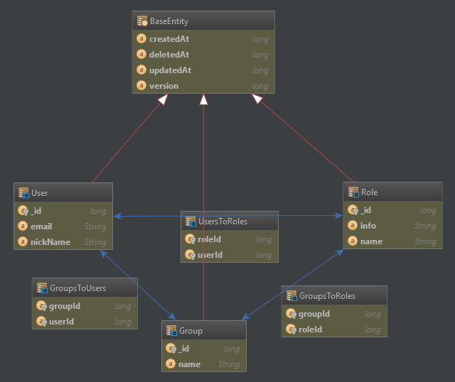
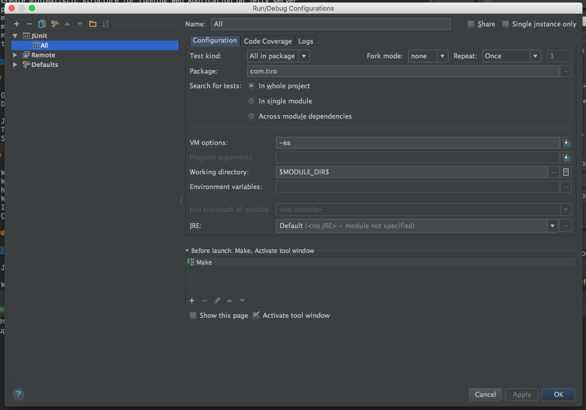
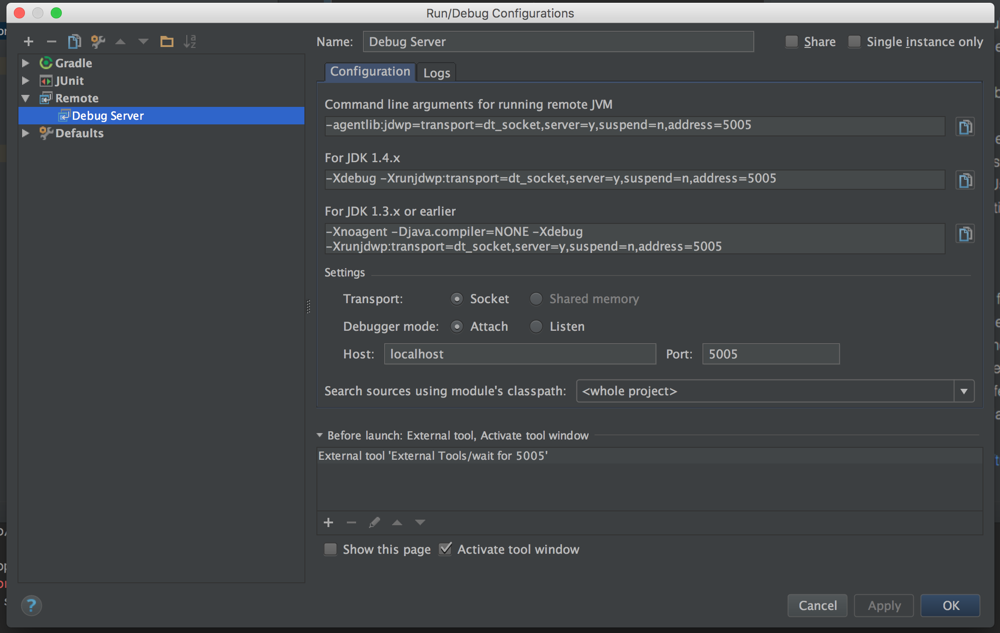
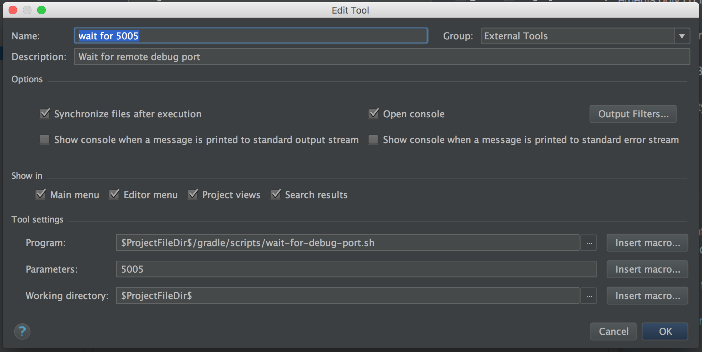
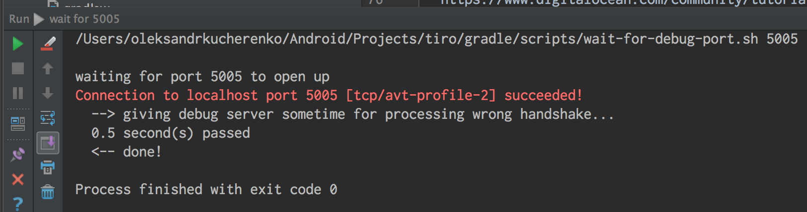

# tiro

[![Join the chat at https://gitter.im/OleksandrKucherenko/tiro][7]][8]

Simplest Java Web Application, Gradle + Jetty + EAR + WAR + JPA + RESTfull

[![Build Status][1]][2] [![codecov][3]][4] [![Code Climate][5]][6]


## Purposes

- create sample for future web applications development
- create minimalistic structure for running Web Application on Jetty server
- pack WAR, EAR files during compilation
- minimalistic RESTfull service with implemented common 'security pattern'
- minimalistic micro-service
- minimalistic Web Application based on micro-service data
- testing of different frameworks

[Roadmap](_documentation_/README.md)

## Features

- GRADLE build system
- Dependencies Update Report
    - ```./gradlew dU```
- Jetty Farm (multiple WARs execution)
- TDD Unit Testing (jUnit)
- SLF4J as a logging framework

## Global Architecture

- Web Application Server should stay behind the NGINX;
- Web Application Server implements only HTTP protocol, NGINX takes HTTPS side;
- NGINX should take responsibilities of: compression, security, caching; 
- Web Application Server implements JSON, ByteBuffer etc. - additional data transfer types;
- Implement common Group/User/Role security pattern, that is often a start point for all solutions
- Cookieless implementation

### Persistence



- JavaX Persistence API used for working with data entities and become agnostic to DB implementation
    - Hibernate used as a concrete implementation of JPA
- Will be used MySQL instance for storing the data in production (most common case in our life):
    - used sqlite in memory database for unit tests running
- Tutorials:
    - http://www.vogella.com/tutorials/JavaPersistenceAPI/article.html
    - http://www.srccodes.com/p/article/7/Annotation-based-Hibernate-Hello-World-example-using-Maven-build-tool-and-SQLite-database
- Hibernate Documentations:
    - https://docs.jboss.org/hibernate/orm/4.0/hem/en-US/html/index.html

## REST

## Implementation

- Used [Jersey framework](https://jersey.java.net/) as a implementation of Jax-RS
- [WADL](https://en.wikipedia.org/wiki/Web_Application_Description_Language) entry points:
  - [DEBUG port:9191](http://localhost:9191/api/application.wadl)
  - [RELEASE port:8080](http://localhost:8080/api/application.wadl)
- Module: [war-api](war-api/README.md)
- Used JSON as a main delivery data format (Jackson Library)

### Alternative Frameworks

- http://resteasy.jboss.org/
    - [RESTFul Web Services for Java](http://docs.jboss.org/resteasy/docs/3.0.16.Final/userguide/html_single/index.html)
- http://vertx.io/

### Documentation

- http://apivisualizer.cuubez.com/
- http://swagger.io/, https://github.com/swagger-api/swagger-core
- https://blogs.oracle.com/sandoz/entry/tracing_in_jersey

### REST Tutorials

- http://www.mkyong.com/webservices/jax-rs/jersey-hello-world-example/
- http://www.vogella.com/tutorials/REST/article.html

## Localization

- http://docs.oracle.com/javase/tutorial/i18n/locale/matching.html

## Testing & Validation

- Validate persistence.xml file: ```./gradlew checkPersistenceXml```
- Run unit tests: ```./gradlew test```
- jUnit tests for low-level system tests (frameworks integration)
- Cucumber for high-level business rules
  

## Debugging

- Attach Intellij debugger to port 5005 (default port)
    - do configuration according to images:
    
    
- Run the configuration in IntelliJ
- Run in terminal ```./gradlew farmRunDebugServer```
    

### What happens? How it works?

- When web server will be ready to start the code it will open debug port 5005
- Our script is waiting for that (waiting for 5005 port opening)
    - all thanks goes to this line: ```nc localhost 5005```

## Deployment

- Gradle build system in use
- Gradle plugin is responsible for web servers: [Gretty](http://akhikhl.github.io/gretty-doc/Feature-overview.html)
- Ready for XCOPY and run as standalone solution with Jetty9 _(or Tomcat8)_:
    - Run command: ```./gradlew buildProduct```
    - Results will be in ```build/output/tiro``` folder

_Alternative to Gretty: [Spring Boost](http://projects.spring.io/spring-boot/)_

## Performance

- https://webtide.com/why-choose-jetty/
- https://github.com/smallnest/Jax-RS-Performance-Comparison
- http://www.asjava.com/jetty/jetty-vs-tomcat-performance-comparison/
- http://menelic.com/2016/01/06/java-rest-api-benchmark-tomcat-vs-jetty-vs-grizzly-vs-undertow/
- https://ibmadvantage.com/2015/09/22/lightweight-java-servers-and-developer-view-on-the-app-server-update/

## All references

- https://www.nginx.com/resources/admin-guide/compression-and-decompression/
- https://nginx.org/en/docs/http/configuring_https_servers.html
- https://www.digitalocean.com/community/tutorials/how-to-configure-nginx-with-ssl-as-a-reverse-proxy-for-jenkins
- https://github.com/ziroby/jetty-gradle-hello-world
- https://docs.jboss.org/hibernate/orm/4.0/hem/en-US/html/index.html
- http://www.vogella.com/tutorials/JavaPersistenceAPI/article.html
- http://www.srccodes.com/p/article/7/Annotation-based-Hibernate-Hello-World-example-using-Maven-build-tool-and-SQLite-database
- http://akhikhl.github.io/gretty-doc/Feature-overview.html
- https://github.com/marc0der/gradle-spawn-plugin
- [jBoss Undertow Web Server](http://undertow.io/)


[1]: https://travis-ci.org/OleksandrKucherenko/tiro.svg?branch=master
[2]: https://travis-ci.org/OleksandrKucherenko/tiro
[3]: https://codecov.io/gh/OleksandrKucherenko/tiro/branch/master/graph/badge.svg
[4]: https://codecov.io/gh/OleksandrKucherenko/tiro
[5]: https://codeclimate.com/github/OleksandrKucherenko/tiro/badges/gpa.svg
[6]: https://codeclimate.com/github/OleksandrKucherenko/tiro
[7]: https://badges.gitter.im/OleksandrKucherenko/tiro.svg
[8]: https://gitter.im/OleksandrKucherenko/tiro?utm_source=badge&utm_medium=badge&utm_campaign=pr-badge&utm_content=badge